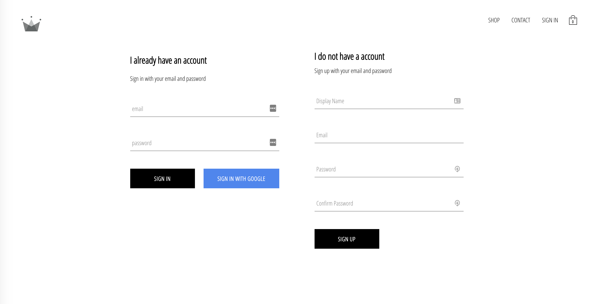
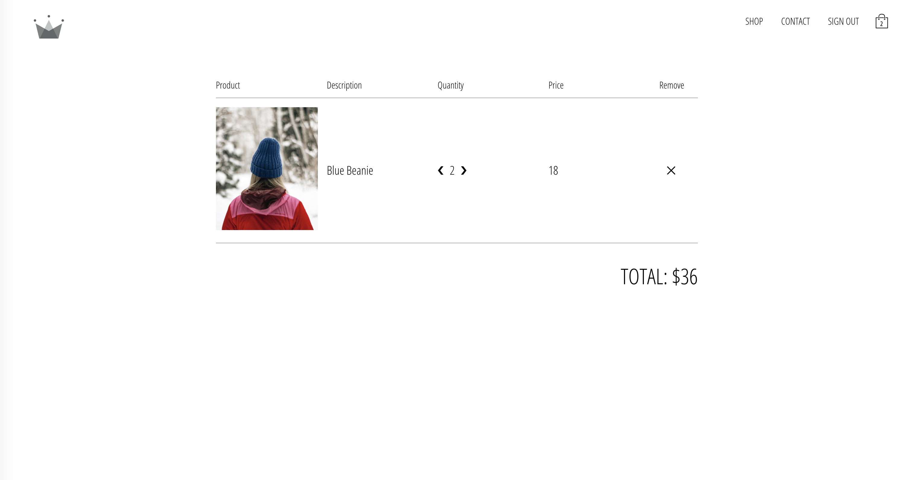

# Fashion Shopping
> Shop online for clothing and fashion accessories

## Table of contents
* [General info](#general-info)
* [Screenshots](#screenshots)
* [Technologies](#technologies)
* [Setup](#setup)
* [Features](#features)
* [Status](#status)

## General info
The application lets user shop online for choths anf fashion accessories for men and women.

## Screenshots
1. Login Page - sign in/sign up using Firebase authentication.

2.Home page with list of all categories.

3.Product page with add to cart functionality.

4.Checkout page

## Technologies
* React 16.8.6
* Redux, Reselect library for statemangement
* React-router for routing
* Firebase for authentication
* scss for styling

## Setup
In your terminal after you clone your project down, remember to run either `yarn` or `npm install` to build all the dependencies in the project.

Replace the `config` variable in your `firebase.utils.js` with your own config object from the firebase dashboard! Navigate to the project settings and scroll down to the config code. Copy the object in the code and replace the variable in your cloned code.

To start the server and serve the pages run `npm start`.

## Features
List of features ready and TODOs for future development
* Login/sign up functionality is implemented.
* List of all available product categories are fetched.
* Products are loaded based on selected category.
* Add to cart functionality and checkout page is implemented.

To-do list:
* Integrate app with firebase.
* Pages has to be made responsive.
* Integrate stripe payment with checkout page.

## Status
Project is: _in progress

